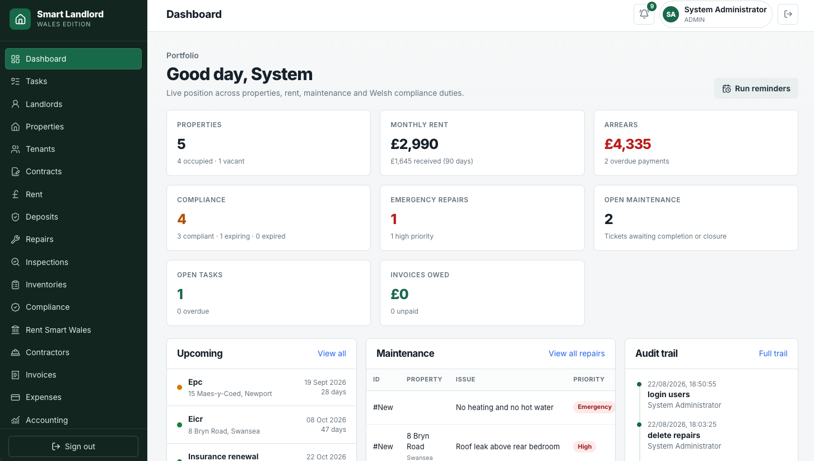

# Smart Landlord

Smart Landlord is a self-hosted property management system designed around Welsh renting records, Rent Smart Wales evidence, occupation contracts, deposits, compliance certificates, repairs, inspections, inventories, invoices, rent, expenses and audit trails.

It runs as two Docker services: a PostgreSQL database and a Node.js application serving both the API and React front end.



This software helps you keep records. It is not legal, tax or accounting advice.

## Features

- Landlord records with Rent Smart Wales registration, licence and CPD fields
- Property master records, insurance, HMO details, mortgage and ownership information
- Contract-holder/tenant records, referencing, guarantors and supporting documents
- Welsh occupation contracts and written-statement tracking
- Rent due dates, receipts, arrears and one-click paid/unreceived status
- Deposit protection tracking for DPS, TDS and MyDeposits
- Automatic red/amber/green compliance status for Gas, EICR, EPC, insurance, legionella, HMO and RSW dates
- Smoke and carbon monoxide alarm records
- Repairs workflow, contractor records, inspections and inventories
- Any-format document uploads linked to repairs, inspections, inventories and compliance records
- Invoices with multiple charge types and mixed VAT rates per invoice
- Expenses, landlord statements, accounting view and CSV exports
- Tasks for visits, follow-ups, renewals and planned changes
- Communication log, notices, reminders and audit trail
- Responsive installable PWA for phone, tablet and desktop browsers

## Requirements

- Linux, macOS, Windows with WSL2, or a NAS that supports Docker
- Docker Engine
- Docker Compose v2 (`docker compose version`)
- At least 2 GB RAM, 4 GB recommended
- About 2 GB free space for images, plus storage for database growth and uploaded documents

## Quick start

### Easiest method

Put the project folder on your server or NAS, then run:

```bash
bash scripts/setup.sh
```

The script checks Docker, creates private database/JWT secrets, creates `.env`, builds the image and starts both containers.

When it finishes, open:

```text
http://localhost:8080
```

If it is running on another machine, use that machine's IP address:

```text
http://192.168.1.50:8080
```

The first admin email and password are saved in `.env` as `ADMIN_EMAIL` and `ADMIN_PASSWORD`.

### Manual method

```bash
mkdir -p secrets
chmod 700 secrets
openssl rand -hex 24 > secrets/db_password.txt
openssl rand -hex 32 > secrets/jwt_secret.txt
chmod 600 secrets/*.txt

cp .env.example .env
nano .env

docker compose up -d --build
```

Example `.env`:

```env
ADMIN_EMAIL=you@example.com
ADMIN_PASSWORD=UseALongPrivatePassword
SEED_DEMO=false
APP_PORT=8080
```

Set `SEED_DEMO=false` before first startup if this will hold real records from day one. If demo data has already been created, changing this value does not delete existing rows.

Important: changing `ADMIN_PASSWORD` in `.env` later does not change an already-created login. After your first sign-in, use **Settings > Change my password**.

## First run checklist

1. Open the app URL.
2. Sign in using `ADMIN_EMAIL` and `ADMIN_PASSWORD`.
3. Go to **Settings**.
4. Change the first admin password immediately.
5. Sign in again with your new password.
6. Create separate accounts for other users.
7. If you loaded demo data, remove it before adding real records, or keep a second clean instance for production.
8. Add landlords, properties, tenants/contract-holders and contracts.
9. Upload certificates under **Compliance > Manage records**.
10. Install the app from your browser if you want home-screen access.

## Everyday workflows

### Add a property

1. Open **Properties**.
2. Click **New**.
3. Complete address, type, bedrooms, authority, ownership and insurance fields.
4. Save.

### Create an occupation contract

1. Add the person under **Tenants**.
2. Open **Contracts** and click **New**.
3. Link property, contract-holder and landlord.
4. Enter start date, rent amount, frequency and due day.
5. Record when the written statement was sent and signed.

### Upload compliance evidence

1. Open **Compliance > Manage records**.
2. Click **New**.
3. Select property and category such as Gas, EICR, EPC or Insurance.
4. Enter inspection/expiry dates.
5. Upload the certificate in any supported browser file format.
6. Save. The document is linked into the vault automatically.

### Manage a repair

1. Open **Repairs**.
2. Click **New**.
3. Link the property and describe the issue.
4. Set priority/status.
5. Upload photos, quotes, invoices or contractor reports.
6. Move the ticket through assigned, quoted, approved, scheduled, completed, invoiced and closed stages.

### Create an invoice

1. Open **Invoices** and click **New**.
2. Select customer and optional property, tenant, landlord or contractor links.
3. Add multiple lines with different charge types and VAT rates.
4. The app calculates net, VAT, discounts and total.
5. Tick an invoice in the list to mark it paid; tick again to mark it unpaid.

## Mobile and desktop access

The same URL serves a responsive website and installable PWA.

- Chrome/Edge desktop: look for the install option in the address bar.
- Android Chrome: menu > **Add to Home screen** or **Install app**.
- iPhone Safari: Share > **Add to Home Screen**.

Browsers generally require HTTPS for PWA installation on non-localhost addresses. For remote use, put the app behind HTTPS.

Full deployment, updating, backup and troubleshooting instructions are in [docs/docker-guide.md](docs/docker-guide.md).

## Security

- Change the generated admin password immediately.
- Create individual accounts rather than sharing one login.
- Keep `.env` and `secrets/` private. They are excluded from Git.
- Do not expose HTTP port 8080 directly to the internet without additional protection.
- For remote access, use HTTPS through Nginx Proxy Manager, Traefik, Caddy or Cloudflare Tunnel.
- Prefer VPN/Tailscale access for a home or small-office deployment.
- Back up both PostgreSQL and uploaded documents separately.
- Review the audit trail regularly because it records create/update/delete/login/upload/payment events.

## Updating

```bash
cd /path/to/smart-landlord
git pull
bash scripts/setup.sh
docker image prune -f
```

Database and upload volumes persist across normal rebuilds.

Always take a backup before updating.

## Backups

```bash
mkdir -p backups
docker compose exec -T db pg_dump -U landlord smart_landlord | gzip > "backups/smart-landlord-db-$(date +%F-%H%M).sql.gz"
docker run --rm -v smart-landlord_app-uploads:/data:ro -v "$PWD/backups":/backup alpine tar czf "/backup/uploads-$(date +%F-%H%M).tar.gz" -C /data .
```

Copy both files to another disk or off-site storage.

Restore examples:

```bash
gunzip -c backups/smart-landlord-db-2026-08-22-1200.sql.gz | docker compose exec -T db psql -U landlord smart_landlord
docker run --rm -v smart-landlord_app-uploads:/data -v "$PWD/backups":/backup alpine sh -c "cd /data && tar xzf /backup/uploads-2026-08-22-1200.tar.gz"
```

## Troubleshooting

### Port already in use

Edit `.env`:

```env
APP_PORT=8090
```

Then restart:

```bash
docker compose up -d
```

### App does not load

```bash
docker compose ps
docker compose logs app
docker compose logs db
```

Both containers should show running/healthy.

### Forgot admin password

Replace `YourNewPassword123` and run from the project folder:

```bash
HASH=$(docker compose exec -T app node -e "console.log(require('bcryptjs').hashSync(process.argv[1],12))" 'YourNewPassword123')
docker compose exec -T db psql -U landlord -d smart_landlord -c "UPDATE users SET password_hash='$HASH' WHERE email='admin@example.com';"
```

### Upload limit

Default maximum is 200 MB per file. To increase it, add this under the app service environment in `docker-compose.yml`:

```yaml
MAX_UPLOAD_MB: 500
```

Then restart:

```bash
docker compose up -d
```

### Completely reset everything

Warning: this deletes all records and uploads.

```bash
docker compose down -v
rm -f secrets/*.txt .env
bash scripts/setup.sh
```

## Architecture

```text
client/       React interface
server/       Express API, auth, uploads and compliance engine
migrations/   PostgreSQL schema
public/       PWA manifest, icons and service worker
scripts/      Setup helper
docs/         Docker guide and screenshots
```

## License

MIT. See [LICENSE](LICENSE).
